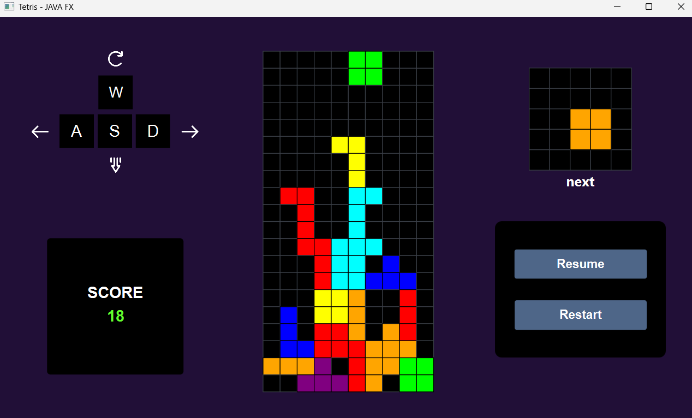
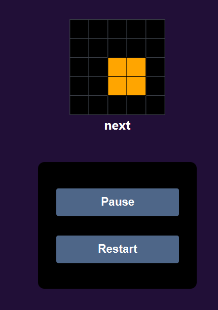
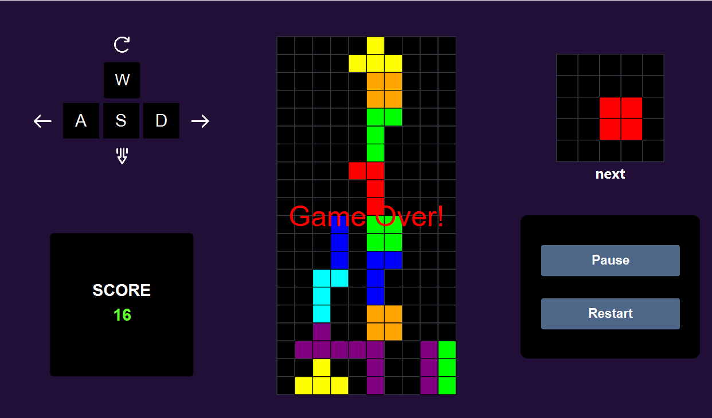

# Tetris Game

  
*A classic Tetris game built with [java, javafx, fxml]*

---

## Table of Contents

- [About](#about)  
- [Features](#features)  
- [Screenshots](#screenshots)  
- [Installation](#installation)  
- [Usage](#usage)  
- [Controls](#controls)  
- [Contributing](#contributing)  
- [License](#license)  

---

## About

This is a classic **Tetris** game implementation. The game features falling blocks, line clearing, and increasing difficulty levels. The goal is to keep the blocks from stacking to the top of the playfield.

---

## Features

- Classic Tetris gameplay  
- Smooth block movements and rotations  
- Line clear animations  
- Increasing speed with levels  
- Score tracking  
- Pause and resume functionality  

---

## Screenshots

### Main Game Screen  


### Pause Menu  


### Game Over Screen  


---

## Installation

1. Clone the repo  
   ```bash
   git clone https://github.com/yourusername/tetris-game.git
   cd tetris-game
